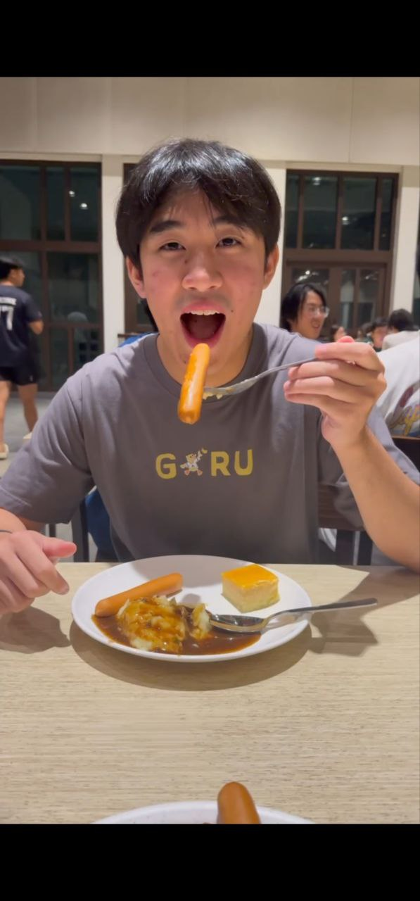
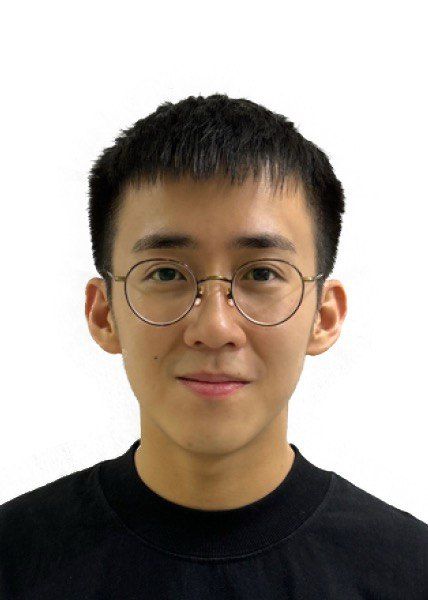
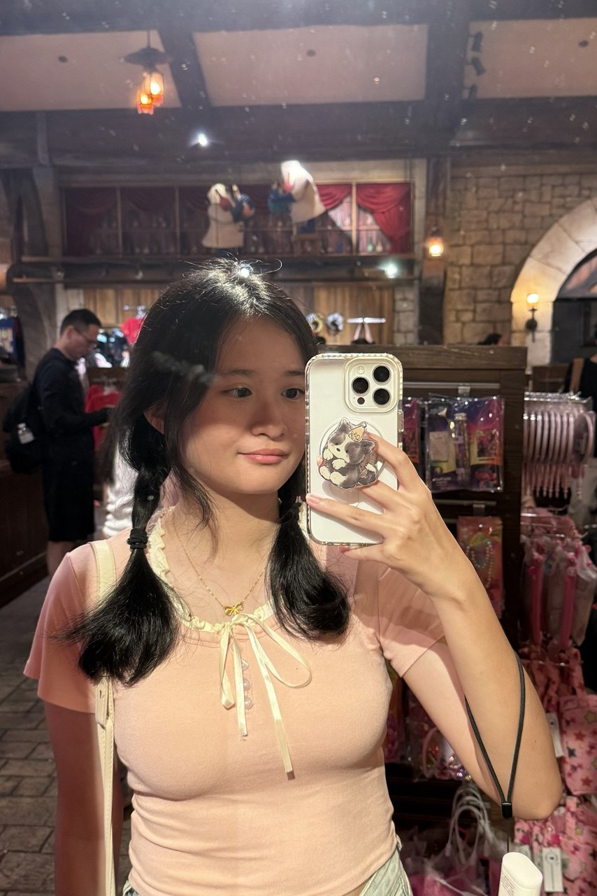
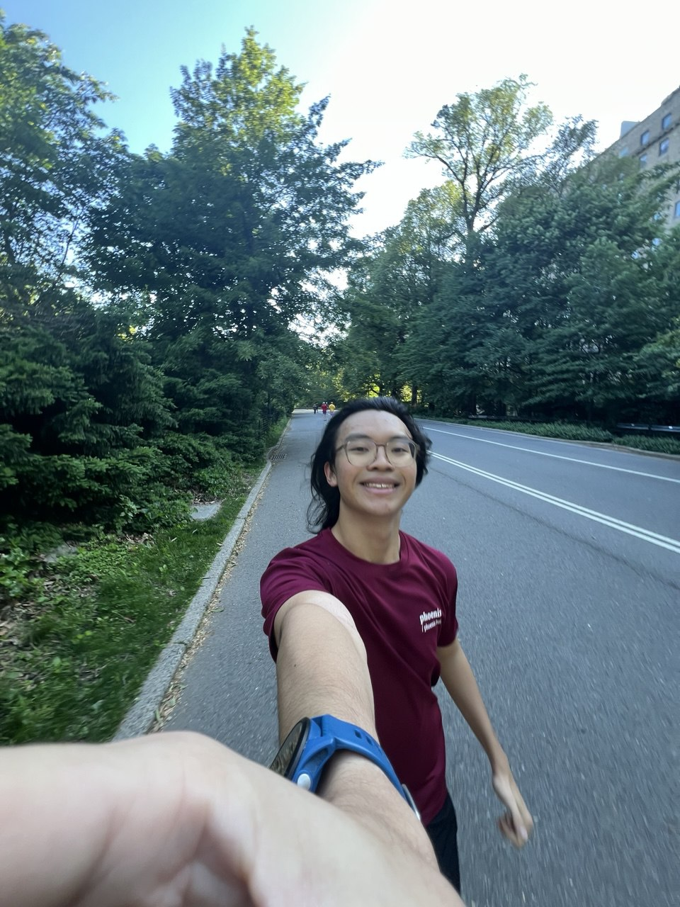
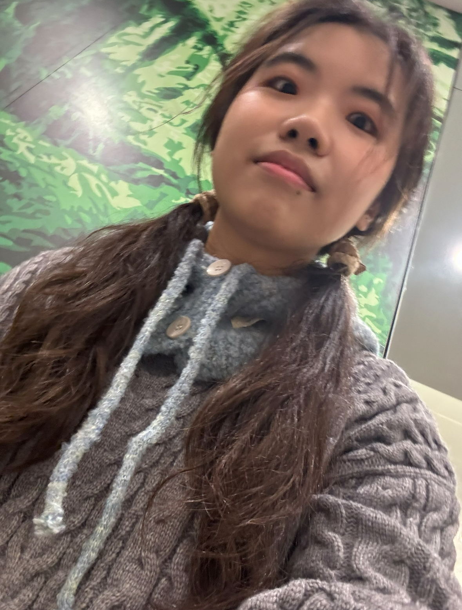

# About Us

We are a team based in the [School of Computing, National University of Singapore](http://www.comp.nus.edu.sg).

You can reach us at the email `seer[at]comp.nus.edu.sg`

## Project team

### Keith Shen

[[github](https://github.com/blurfrost)]
[[portfolio](team/blurfrost.md)]

* Role: Developer
* Responsibilities: Documentation, UI

### Shawn Wee

[[github](http://github.com/McFishhh)]
[[portfolio](team/mcfishhh.md)]

* Role: Developer
* Responsibilities: Scheduling and Tracking

### Zheng Chenyi Joan

[[github](http://github.com/wafflescloud)] [[portfolio](team/wafflescloud.md)]

* Role: Developer
* Responsibilities: Data

### Morpheus

[[github](http://github.com/morpheuschoo)]
[[portfolio](team/morpheuschoo.md)]

* Role: Vscdoe Expert (with Github Copilot)
* Responsibilities: Data

### She Jingling

[[github](http://github.com/jlismee)]
[[portfolio](team/jlismee.md)]

* Role: Developer
* Responsibilities: UI
