# Furiends User Guide

Furiends is a **desktop application** tailored towards animal lovers, specifically individuals who are tasked to feed stray animals.
It is optimized for use of **text-based commands** while still providing **visual elements** such as windows and buttons to interact with the application.
Furiends can help you manage people, animals and their interactions efficiently.

## Table of Contents

- [Quick start](#quick-start)
- [Overview of Interface](#overview-of-interface)
- [Features](#features)
  - [Valid input formats](#valid-inputs-format)
  - [Viewing help: `help`](#viewing-help-help)
  - [Adding a person: `add person`](#adding-a-person-add-person)
  - [Adding an animal: `add animal`](#adding-an-animal-add-animal)
  - [Listing all contacts: `list`](#listing-all-contacts-list)
  - [Editing a person: `edit person`](#editing-a-person-edit-person)
  - [Editing an animal: `edit animal`](#editing-an-animal-edit-animal)
  - [Finding people by name: `find person`](#finding-people-by-name-find-person)
  - [Finding animals by name: `find animal`](#finding-animals-by-name-find-animal)
  - [Feeding an animal: `feed`](#feeding-an-animal-feed)
  - [Deleting a person: `delete person`](#deleting-a-person-delete-person)
  - [Deleting an animal: `delete animal`](#deleting-an-animal-delete-animal)
  - [Deleting a feeding session: `delete feed`](#deleting-a-feeding-session-delete-feed)
  - [Viewing a person contact: `view person`](#viewing-a-person-contact-view-person)
  - [Viewing an animal contact: `view animal`](#viewing-an-animal-contact-view-animal)
  - [Undoing the last change: `undo`](#undoing-the-last-change-undo)
  - [Redoing an undone change: `redo`](#redoing-an-undone-change-redo)
  - [Clearing all entries: `clear`](#clearing-all-entries-clear)
  - [Exiting the program: `exit`](#exiting-the-program-exit)
  - [Saving the data](#saving-the-data)
  - [Editing the data file](#editing-the-data-file)
- [FAQ](#faq)
- [Known issues](#known-issues)
- [Command summary](#command-summary)

--------------------------------------------------------------------------------------------------------------------

<div style="page-break-after: always;"></div>

## Quick start

1. Ensure you have Java `17` or above installed in your Computer.<br>
  **For Mac users:** Ensure you have the precise JDK version prescribed [here](https://se-education.org/guides/tutorials/javaInstallationMac.html). <br>
  **For Windows users:** Java `17` can be downloaded [here](https://www.oracle.com/java/technologies/downloads/#java17-windows).

    - To check the Java version in your device, open the terminal and type `java --version`.
    - You should obtain an output like below:
      ```
      java 17.0.12 2024-07-16 LTS
      Java(TM) SE Runtime Environment (build 17.0.12+8-LTS-286)
      Java HotSpot(TM) 64-Bit Server VM (build 17.0.12+8-LTS-286, mixed mode, sharing)
      ```

2. Download the latest `furiends.jar` file from [here](https://github.com/AY2526S1-CS2103T-W14-3/tp/releases).

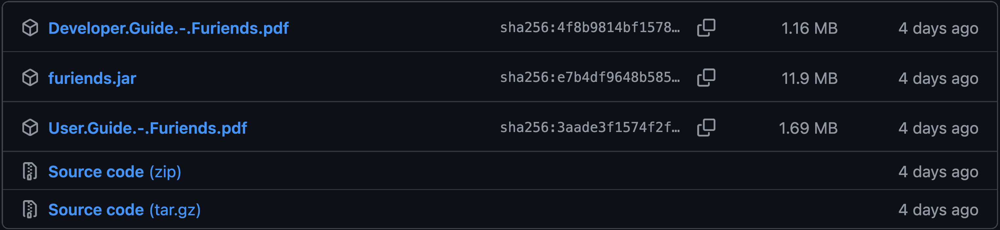{style="width:900px; height:auto; border-radius:10px; box-shadow: 0 8px 16px rgba(0,0,0,0.3);"}<br>

<box type="tip" seamless>

The file is usually in the `Downloads` folder after downloading it.
</box>

3. At the location where you want Furiends to be, create a folder with any name that you like!

4. Then, copy the file `furiends.jar` into the folder created in (3).

<div style="page-break-after: always;"></div>

5. Booting up Furiends:

   **For Mac users:**
   1. Open **Terminal** (you can find it in `Applications > Utilities > Terminal` or search using Spotlight with `Cmd + Space`).
   2. Navigate to the folder containing `furiends.jar` using the `cd` command.
      * For example, if the file is in your `Documents/Furiends` folder, type: `cd ~/Documents/Furiends`
   3. Type `java -jar furiends.jar` and press Enter to launch Furiends.

    <br>

   **For Windows users:**
   1. Navigate to the folder containing `furiends.jar` in **File Explorer**.
   2. Right-click on the folder (or right-click on empty space inside the folder) and select **Open in Terminal**.
   3. In the terminal window that opens, type `java -jar furiends.jar` and press Enter to launch Furiends.

<br>
<div style="text-align: center;">

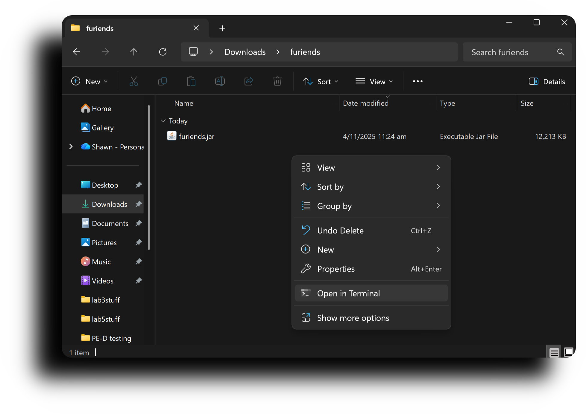{style="width:500px; height:auto; border-radius:6px; box-shadow: 0 8px 16px rgba(0,0,0,0.3);"}

</div>
<br>

<div style="page-break-after: always;"></div>

   A interface similar to the below should appear in a few seconds. Note how the application contains some sample data.<br>
   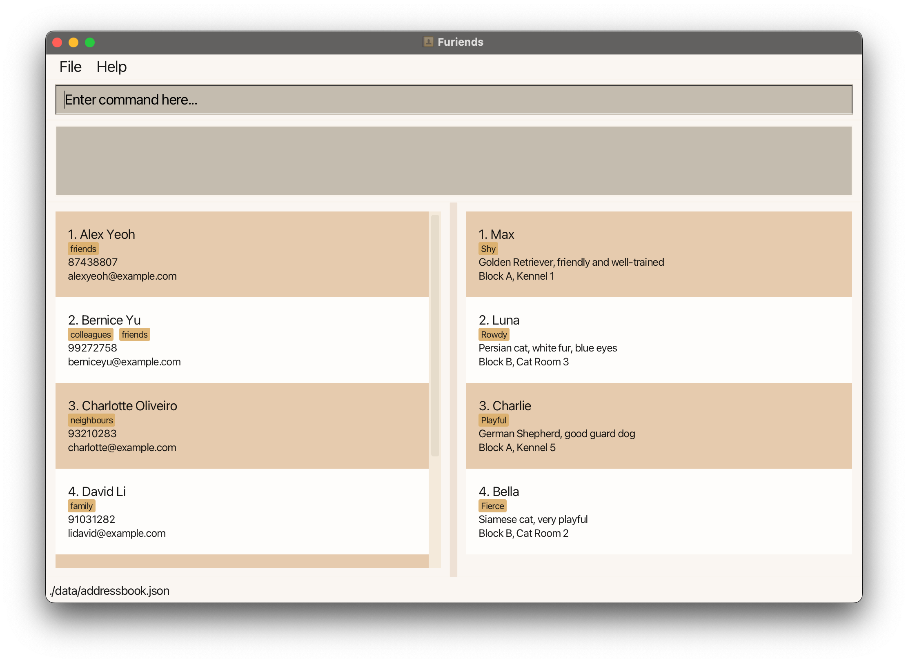{style="width:90 0px; height:auto;"}<br>
   For more details on the interface, you can refer to the [Overview of Interface](#overview-of-interface) section.

6. Type the command in the command box (displaying *"Enter command here..."*) and press Enter to execute it.
<br><br>
  Here are some simple commands you can try:

    * `help` : Shows the help page with the full list of commands.
    <br>
    * `list` : Lists all people's and animals' contacts.
    <br>
    * `clear` : Deletes all people's and animals' contacts.
    <br>
    * `exit` : Exits the Furiends application.
    <br><br>

7. Refer to the [Features](#features) below for details of each command.

------------------------------------------------------------------------------------------------

<div style="page-break-after: always;"></div>

## Overview of Interface
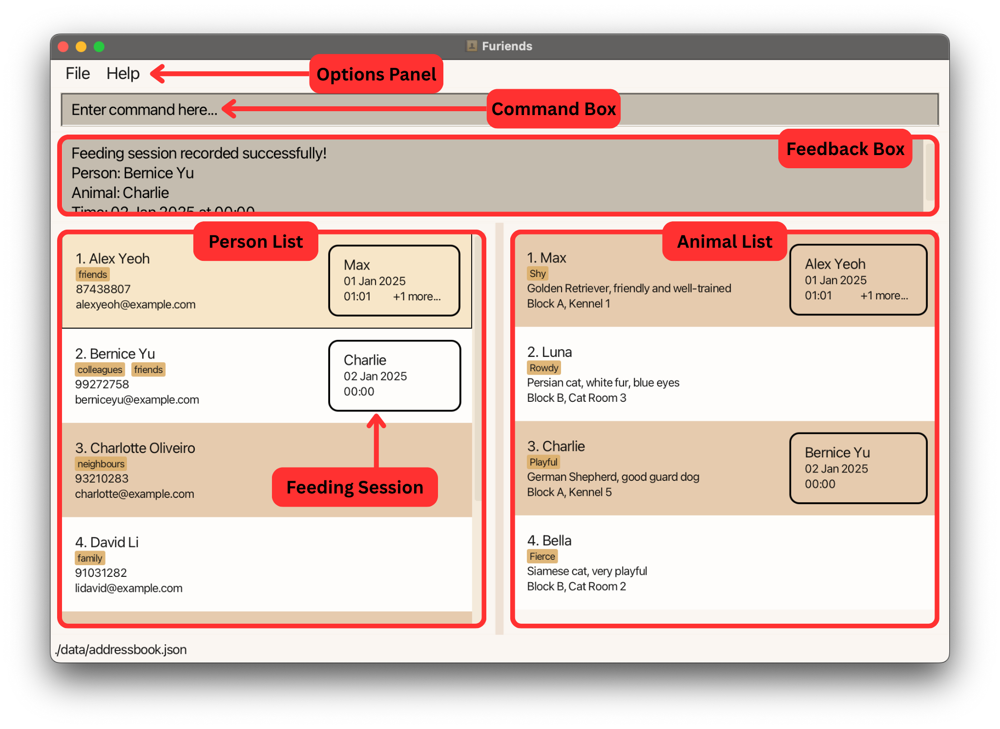{style="width:900px; height:auto;"}

The interface of Furiends is made up of the following components:
1. **Options Panel**: Contains menu bars to exit (File > Exit) and open the help panel (Help > Help).
2. **Command Box**: Commands are entered in this text box. Press the Enter key to execute the command.
3. **Feedback Box**: Furiends displays the result of the executed command in this box.
4. **Person List**: Displays the list of people stored in Furiends.
   * The **feeding session** shown under each person indicates the earliest feeding session for the animals that person is feeding.
5. **Animal List**: Displays the list of animals stored in Furiends.
   * The **feeding session** shown under each animal indicates the earliest feeding session for the people feeding that animal.

------------------------------------------------------------------------------------------------

<div style="page-break-after: always;"></div>

## Features

<box type="info" seamless>

**Notes about the command format:**<br>

* Words in `UPPER_CASE` are the parameters to be supplied by the user.<br>
  e.g. in `add person n/NAME...`, `NAME` is a parameter which can be used as `add person n/John Doe...`.
* Items in square brackets are optional.<br>
  e.g `n/NAME ... [t/TAG]` can be used as `n/John Doe ... t/friend` (friend tag added)
  or as `n/John Doe ... `(no tag provided).

* Items with `…` after them can be used multiple times, including zero. <br>
  For example, `[t/TAG]…` can be omitted, used once as `t/friend`, or used multiple times as `t/friend t/family`.

* Parameters can be in any order.<br>
  e.g. if the command specifies `n/NAME p/PHONE`, `p/PHONE n/NAME` is also acceptable.

* Extra parameters for commands that do not take in parameters
  (such as `list`, `exit` and `clear`) will be ignored.<br>
  e.g. if the command specifies `list 123`, it will be interpreted as `list`.

* Command keywords, and type specifiers should be in lowercase. <br>
  (Command keywords referring to `add`, `delete`, etc. Type specifiers referring to  `person`/`animal`.)
</box>

<box type="warning" seamless>

If you are using a PDF version of this document, be careful when copying and pasting commands that span multiple lines as space characters surrounding line-breaks may be omitted when copied over to the application.
</box>

Back to [table of contents](#table-of-contents).

<div style="page-break-after: always;"></div>

### Valid Inputs Format
* `NAME`/`PERSON_NAME`/`ANIMAL_NAME`
  * Can only contain letters (`A-Z` and `a-z` only).

  * Character limit of 1-30 (after removal of additional white spaces).

  * Person/animal names are unique, no duplicate names accepted.

  * Case-insensitive.

  <box type="tip" seamless>

    Input `john` is the same as `JOHN`.
  </box>

* `PHONE`
  * Can only contain digits `0-9`.

  * Minimum 3 digits required.

  * Phone numbers are unique, no duplicate numbers accepted.

  * e.g. `123`, `91234567`, `81234567`

<br>

<div style="page-break-after: always;"></div>

* `EMAIL`
  * Must adhere to the **RFC5322** email format:
  * `local-part@domain`
    * `local-part`: can contain alphanumeric characters and special characters such as ``!#$%&'*+/=?^_`{|}~-`` <br><br>
    <box type="warning" seamless>

    Periods `.` are allowed in the `local-part`, but it **cannot** start or end with a period.
    Consecutive periods `..` are also not allowed.
    </box>
    <box type="info" seamless>

    The `local-part` can also be a quoted string (enclosed in double quotes `"`), which allows
    additional special characters and spaces.
    </box>

    * `@`: must have separator symbol between `local-part` and `domain`.
    * `domain`: must follow domain naming conventions with a hierarchical structure (e.g., `example.com`)
      * Can be a standard domain name with labels separated by periods
      * Can be an IP address enclosed in square brackets `[` `]`
      * Domain labels must start and end with alphanumeric characters, and can contain hyphens in between <br><br>
  * **Character limit: 998** (including `@` and all characters).
  * Emails are unique, no duplicate emails accepted.
  * Emails are **case-insensitive** for both `local-part` and `domain`.
  * e.g. `johndoe@email.com`, `he.he_123@gotmail.com`, `user+tag@example.co.uk`

  <br>

* `TAG`
  * Can only contain letters and digits.

  * Character limit of 30 (including all white spaces).

  * e.g. `fluffy fur`, `cutie12 3`, `barker`

<br>

<div style="page-break-after: always;"></div>

* `DATETIME`
  * Format: `YYYY-MM-DD HH:mm`

  * Must be a valid date and time.

    * `YYYY` — 4-digit year
      * e.g. `2025`
      * Acceptable range: `0000` - `9999`

    <br>

    * `MM` — 2-digit month
      * e.g. `March` is `03`, `October` is `10`
      * Acceptable range: `01` - `12`

    <br>

    * `DD` — 2-digit day
      * e.g. `02`, `28`
      * Acceptable range depends on the month:
        * `01` - `31`: January, March, May, July, August, October, December
        * `01` - `30`: April, June, September, November
        * `01` - `28`: February (non-leap years)
        * `01` - `29`: February (leap years)

    <br>

    * `HH:mm` — 4 digits separated by `:` following the 24-hour clock
      * e.g. `7:05PM` is `19:05`
      * `HH` — 2-digit hours
        * Acceptable range: `00` - `23`
      * `mm` — 2-digit minutes
        * Acceptable range: `00` - `59`

  <br>

  * Date and time must be separated by **a single space**
  * e.g. `2025-10-01 18:59`, `2005-04-25 07:05`

  <br>

* `DESCRIPTION`
  * Character limit of 200 (including internal white spaces).

  * e.g. `cat that bites,,, meow`, `too fat need lose weight!`

  <br>

* `LOCATION`
  * Character limit of 100 (including internal white spaces).

  * e.g. `AMK Street 3497`, `blk A7!`

<div style="page-break-after: always;"></div>

* `KEYWORD`
  * Comes in 2 different forms, `NAME` and `TAG` only.

  * Characters length of 1-30 allowed after removal of extra white spaces.

  * Only alphabets `A–Z`, `a–z`, digits `0-9`, and spaces allowed.

  * e.g. `n/bobby`, `n/Max 1`, `t/fluffy`, `t/fluf`

<br>

Back to [table of contents](#table-of-contents).

--------------------------------------------------------------------------------------------------------------------

<div style="page-break-after: always;"></div>

### Viewing help: `help`

Use the `help` command to displays a window, which links to the user guide, as well as a list of commands. <br>

Format: `help [COMMAND]` <br>

You can open the general help window *(in the image below)* by entering `help` in the command box.

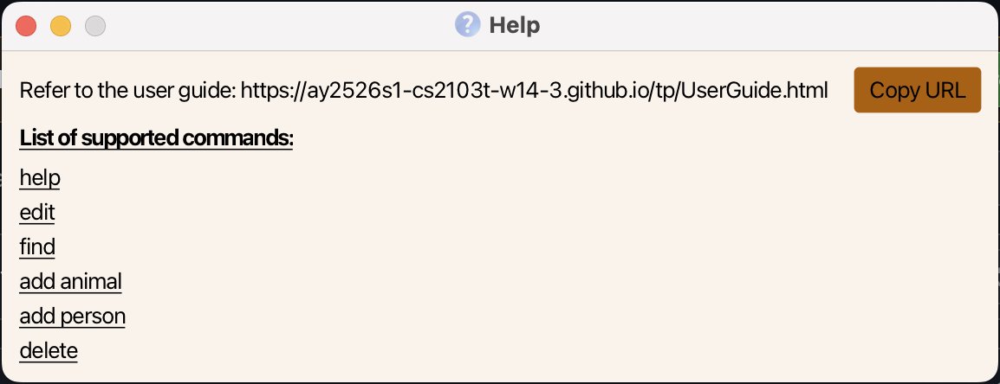{style="width:700px; height:auto;"}

Each command is clickable. Clicking a command opens another window which shows additional details regarding the command's usage. <br>

You can also open this window by entering `help [COMMAND]` in the command box. <br>

<div style="page-break-after: always;"></div>

In the example below, when clicking the `help` command *(as shown in the image above)*, a new window will pop up to show
the details of the `help` command and its usage. <br>

The window shown below can also be opened by entering `help help` in the command box.

{style="width:700px; height:auto;"}

Clicking on the command format template copies the command format to the command box in the main application window
and closes this window. For example, clicking on the command format template `help [COMMAND]` will copy
the corresponding command format to the command box as shown below.

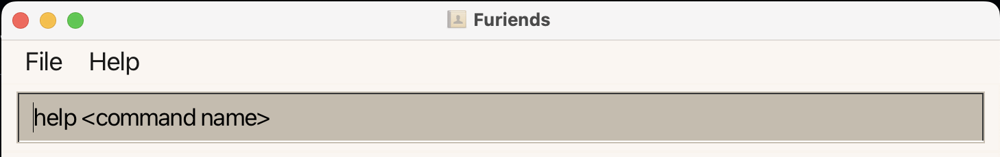{style="width:700px; height:auto;"} <br>

Back to [table of contents](#table-of-contents).

<div style="page-break-after: always;"></div>

### Adding a person: `add person`

Use the `add person` command to add a person to Furiends.<br>

Format: `add person n/NAME p/PHONE e/EMAIL [t/TAG]…​`

* You may assign any number of tags (including none) to a person.

Examples: refer to input restrictions [here](#valid-inputs-format)!
* `add person n/John Doe p/98765432 e/johnd@example.com`
* `add person n/Betsy Crowe t/friend e/betsycrowe@example.com p/91234567 t/criminal`<br>
  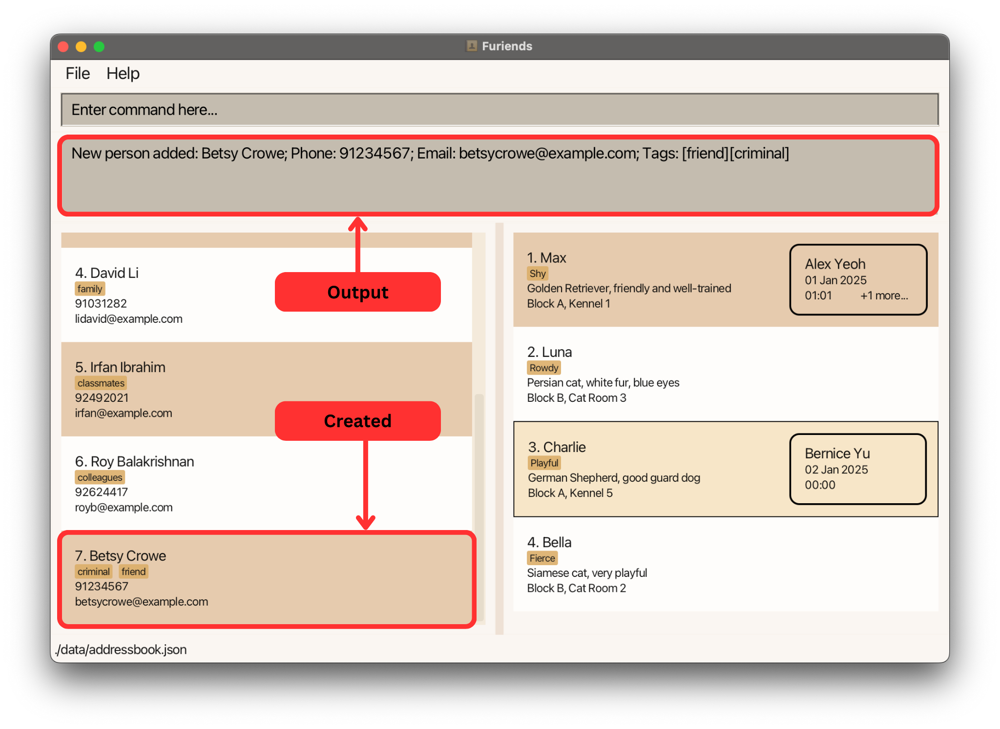{style="width:700px; height:auto;"}

Back to [table of contents](#table-of-contents).

<div style="page-break-after: always;"></div>

### Adding an animal: `add animal`

Use the `add animal` command to add an animal to Furiends.

Format: `add animal n/NAME d/DESCRIPTION l/LOCATION [t/TAG]…​`

Examples: refer to input restrictions [here](#valid-inputs-format)
* `add animal n/Fluffy d/White cat l/Ang Mo Kio t/shy`<br>
  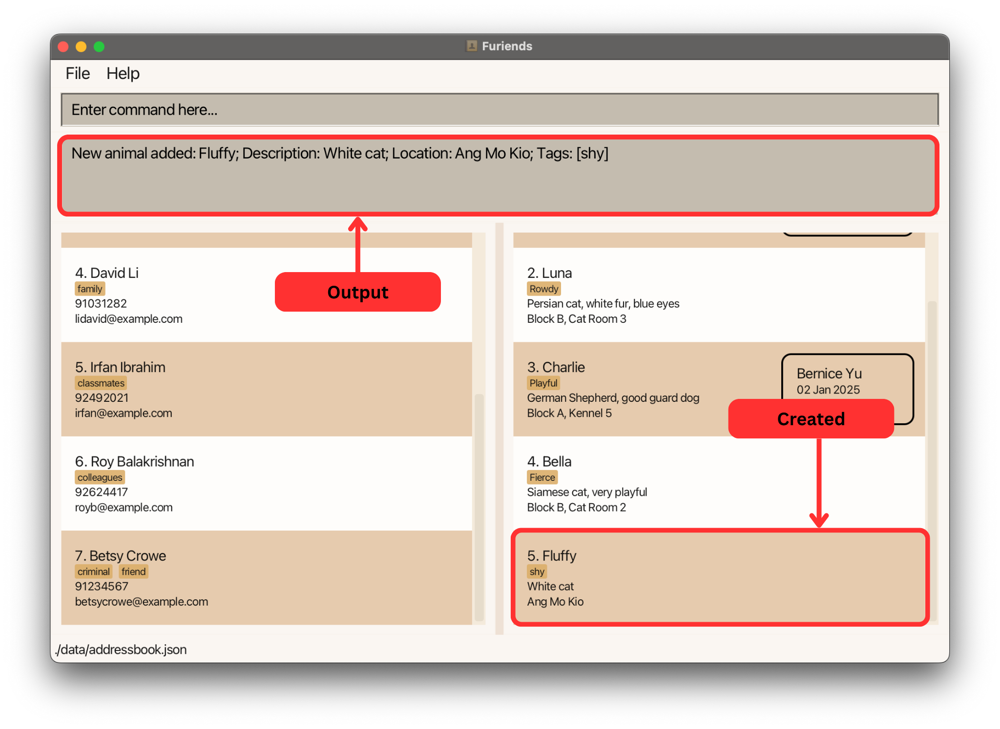{style="width:700px; height:auto;"}

Back to [table of contents](#table-of-contents).

<div style="page-break-after: always;"></div>

### Listing all contacts: `list`

Use the `list` command to display all people and animals saved in Furiends.

Format: `list`

Back to [table of contents](#table-of-contents).

<div style="page-break-after: always;"></div>

### Editing a person : `edit person`

Use the `edit person` command to update an existing person's details in Furiends.

Format: `edit person NAME [n/NAME] [p/PHONE] [e/EMAIL] [t/TAG]…​`

* Edits the person with the specified `NAME`. The name is **case-insensitive**.
* At least one of the optional fields must be provided.
* Existing values will be updated to the input values.
* **Only when editing tags**, the existing tags of the person will be removed.
  * i.e adding of tags is not cumulative.

<box type="tip" seamless>

You can remove all the person’s tags by typing `t/` without
specifying any tags after it.
</box>

Examples: refer to input restrictions [here](#valid-inputs-format)

*  Example below: `edit person Bernice Yu p/61234567 e/johndoe@example.com t/lover` <br>
   This command edits the phone number and email address of the person with name `Bernice Yu` to be `61234567`
   and `johndoe@example.com` respectively.

    <div style="display: flex; flex-direction: column; align-items: center; gap: 20px; margin: 20px 0;">
      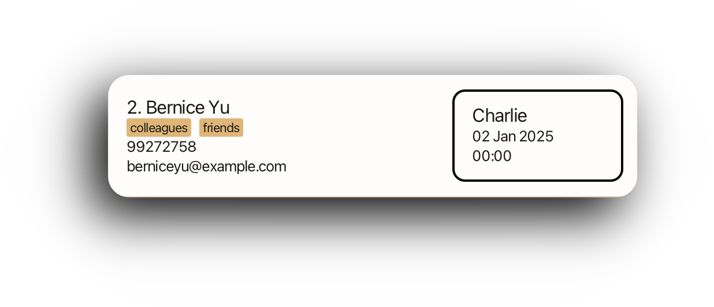
      <span style="font-size: 25px; color: #666;">↓</span>
      
    </div>


    `Bernice Yu` will now only have the new added tag, `lover`, instead of the original tags.

*  `edit person Betty Crower n/Betsy Crower t/` <br>
    This command edits the name of `Betty Crower` to be `Betsy Crower` and clears all existing tags.


Back to [table of contents](#table-of-contents).
<div style="page-break-after: always;"></div>

### Editing an animal : `edit animal`

Use the `edit animal` command to update an existing animal's details in Furiends.

Format: `edit animal NAME [n/NAME] [d/DESCRIPTION] [l/LOCATION] [t/TAG]…​`

* Edits the animal with the specified `NAME`. The name is **case-insensitive**.
* At least one of the optional fields must be provided.
* Existing values will be updated to the input values.
* **Only when editing tags**, the existing tags of the animalo will be removed.
  * i.e adding of tags is not cumulative.

<box type="tip" seamless>

You can remove all the animal’s tags by typing `t/` without
specifying any tags after it.
</box>

Examples: refer to input restrictions [here](#valid-inputs-format)
*  `edit animal Fluffy l/Void Deck` <br>
   This command edits the location of the animal with name `Fluffy` to be `Void Deck`.
*  `edit animal Kitty n/Catty t/` <br>
   This command edits the name of the animal with name `Kitty` to be `Catty` and clears all existing tags.

Back to [table of contents](#table-of-contents).

<div style="page-break-after: always;"></div>

### Finding people by name: `find person`

Use the `find person` command to locate people whose names contain any of the given keywords.

Format: `find person [n/KEYWORD] [t/KEYWORD] [MORE_KEYWORDS]...`

* The search is **case-insensitive**. <br>
  e.g `hans` will match `Hans`.
* Separate keywords should be individually prefixed with `n/`
* The order of the keywords does not matter. <br>
  e.g. `n/Hans n/Bo` will match the name`Bo Hans`.
* Only the name and tag (when specified) are searched.
* Substrings can be searched. e.g. `an` will match `Hans`, `Andy`.
* People's names matching at least one keyword will be returned (i.e. `OR` search). <br>
  e.g. `n/Hans n/Bo` will return `Hans Gruber`, `Bo Yang`.
* Searching using tags must have the **exact case-insensitive spelling**.<br>
  e.g. `t/friends` will return the same result as `t/FRIENDS`.
  * Only people with the tag `friends` will be shown.
<box type="info" seamless>

  People with the tag `friend` will not be shown as the spelling is not exactly the same.
</box>

* When there is both `[n/KEYWORD]` and `[t/KEYWORD]` present, it will conduct a substring search of names **and** a full string search of tags. <br>
  * People's names with substring matching **at least one** `n/KEYWORD` **and** with tags **exactly matching** all `t/KEYWORD` will be returned.
  * e.g. `find person n/ber t/friends` will only return contacts with substring `ber` in their names and tagged with `friends`.
    * `Bernice` with `t/friends, t/lover` will be returned.
    * `Berry` with no tags **will not** be returned.
    * `Ber` with `t/friend` **will not** be returned.

<div style="page-break-after: always;"></div>

Examples: refer to input restrictions [here](#valid-inputs-format)
* `find person n/alex n/dav` <br>
   This command returns `Alex Yeoh`, `David Li`. Note that the 'animal' portion is still shown.<br>

  {style="width:800px; height:auto;"}<br>
<div style="page-break-after: always;"></div>

* `find person t/friends` <br>
  This command returns `Alex Yeoh`, `Betsy Crowe`. Note that the 'animal' portion is still shown.<br>

  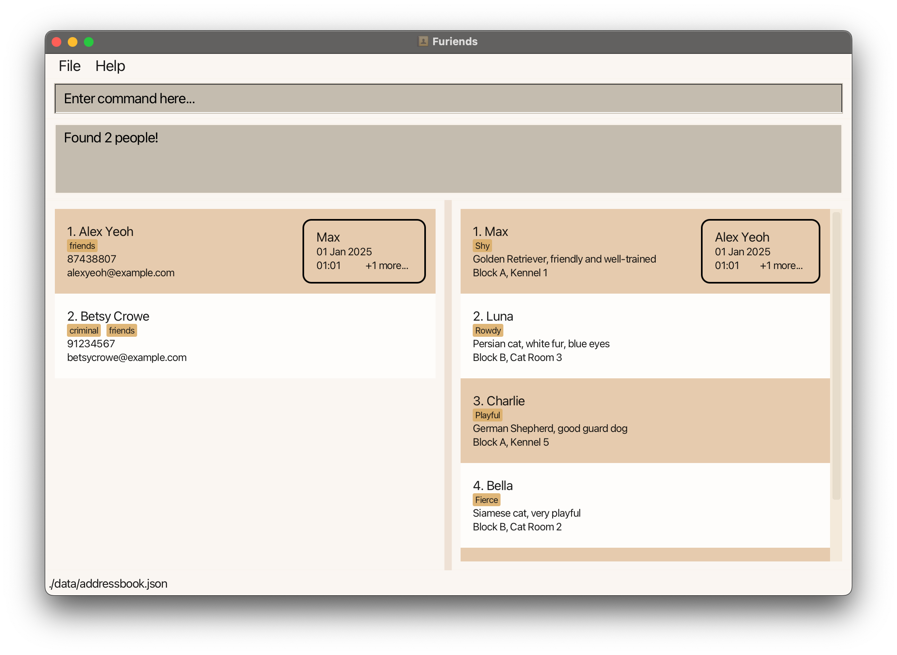{style="width:800px; height:auto;"}<br>
<box type="info" seamless>

After using `find` to filter out the contacts you want, you can use `list` to return
to full display of all contacts. <br>
[Find out how](#listing-all-contacts-list)!
</box>

Back to [table of contents](#table-of-contents).

<div style="page-break-after: always;"></div>

### Finding animals by name: `find animal`

Use the `find animal` command to locate animals whose names contain any of the given keywords.

Format: `find animal [n/KEYWORD] [t/KEYWORD] [MORE_KEYWORDS]...`

* The search is **case-insensitive**. <br>
  e.g `fluffy` will match `Fluffy`.
* Separate keywords should be individually prefixed with `n/`
* The order of the keywords does not matter. <br>
  e.g. `n/Cutie n/Pie` will match `Pie Cutie`.
* Only the name and tag (when specified) are searched.
* Substrings can be matched. <br>
  e.g. `Fluff` will match `Fluffy` and `Kerfluff`.
* Animals' name matching at least one keyword will be returned (i.e. `OR` search). <br>
  e.g. `n/Cutie` will return `Cutie Pie`, `Cutie Patootie` (if both animals are stored in the application).
* Searching using tags must have the **exact case-insensitive spelling**. <br>
  e.g. `t/furry` will return the same result as `t/FURRY`.
  * Only animals with the tag `furry` will be shown.
<box type="info" seamless>

  Animals with the tag `fur` will not be shown as the spelling is not exactly the same.
  </box>

* When there is both `[n/KEYWORD]` and `[t/KEYWORD]` present, it will conduct a substring search of names **and** a full string search of tags. <br>
* Animals' names with substring matching **at least one** `n/KEYWORD` **and** with tags **exactly matching** all `t/KEYWORD` will be returned.
* e.g. `find animal n/ch t/fierce` will only return contacts with substring `ch` in their names and tagged with `fierce`.
  * `Gochu` with `t/fierce, t/fat` will be returned.
  * `Cherry` with no tags **will not** be returned.
  * `Charlie` with `t/fire` **will not** be returned.

<div style="page-break-after: always;"></div>

Examples: refer to input restrictions [here](#valid-inputs-format)
* `find animal n/max n/luna` <br>
  This command returns `Max`, `Luna`. Note that the 'person' portion is still shown.<br>

  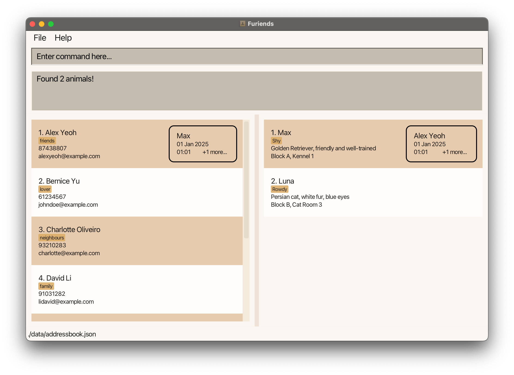{style="width:800px; height:auto;"}
<box type="info" seamless>

After using `find` to filter out the contacts you want, you can use `list` to return
to full display of all contacts. <br>
[Find out how](#listing-all-contacts-list)!
</box>

Back to [table of contents](#table-of-contents).

<div style="page-break-after: always;"></div>

### Feeding an animal : `feed`
Use the `feed` command to record a feeding session between an animal and a person (feeder) in Furiends.

Format: `feed f/PERSON_NAME n/ANIMAL_NAME dt/DATETIME`

* **A feeding session** can only involve **an animal** and **a person**.
* An animal can have **more than 1 feeding sessions**. <br>
  e.g. `Max` can have **2** different feeding sessions — 1 with `Alex Yeoh` and 1 with `Bernice Yu`.
  * `Max` is being fed by **2** different people.
* A person can feed **more than 1 animal**. <br>
  e.g. `Alex Yeoh` can have **2** different feeding sessions — 1 with `Max` and 1 with `Luna`.
  * `Alex Yeoh` is feeding **2** different animals.
* `DATETIME` must be a valid day and time.
* The order of `n/ANIMAL_NAME`, `f/PERSON_NAME` and `dt/DATETIME` does not matter.

<div style="page-break-after: always;"></div>

Examples: refer to input restrictions [here](#valid-inputs-format)
* `feed f/Alex Yeoh n/Max dt/2025-01-24 09:00` <br>
   This command assigns `Alex Yeoh` and `Max` to the same feeding session. <br>

<!-- <div style="display: flex; flex-direction: column; align-items: center; gap: 30px; margin: 20px 0;">
  <div style="display: flex; align-items: center; gap: 20px;">
    
    <span style="font-size: 48px; color: #666;">→</span>
    
  </div>
  <div style="display: flex; align-items: center; gap: 20px;">
    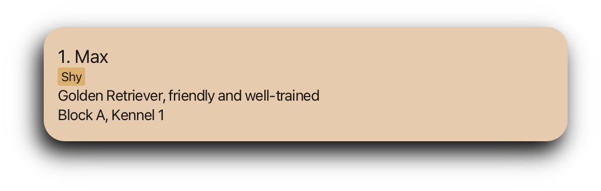
    <span style="font-size: 48px; color: #666;">→</span>
    
  </div>
</div> -->


<div style="display: flex; flex-direction: column; align-items: center; gap: 30px; margin: 20px 0;">
  
  
  <span style="font-size: 30px; color: #666;">↓</span>
  
  
</div>

<box type="info" seamless>

**The earliest feeding date is displayed in the main window** beside each person's or animal's contact with at least 1 feeding session.

To view all feeding sessions associated to a person's or animal's contact, you can use the [View](#viewing-a-person-contact-view-person) command or double click on the contact to bring up the full contact information.

</box>

Back to [table of contents](#table-of-contents).

<div style="page-break-after: always;"></div>

### Deleting a person : `delete person`

Use the `delete person` command to remove the specified person from Furiends.

Format: `delete person n/NAME`

* Deletes the person with the specified `NAME`.
* The name is **case-insensitive**.

Examples: refer to input restrictions [here](#valid-inputs-format)
* `delete person n/Alex Yeoh` <br>
  This command deletes the person with name `Alex Yeoh` from Furiends.
  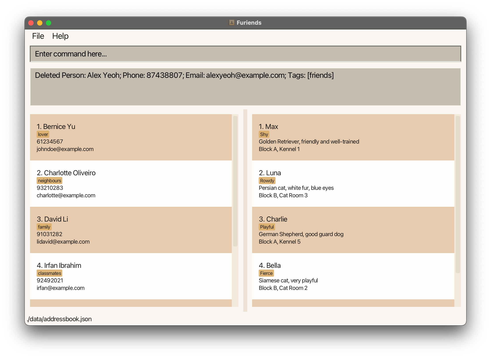{style="width:900px; height:auto;"}<br>

Back to [table of contents](#table-of-contents).

<div style="page-break-after: always;"></div>

### Deleting an animal: `delete animal`

Use the `delete animal` command to remove the specified animal from Furiends.

Format: `delete animal n/NAME`

* Deletes the animal with the specified `NAME`.
* The name is **case-insensitive**.

Examples: refer to input restrictions [here](#valid-inputs-format)
* `delete animal n/Max` <br>
  This command deletes the animal with name `Max` from Furiends.
  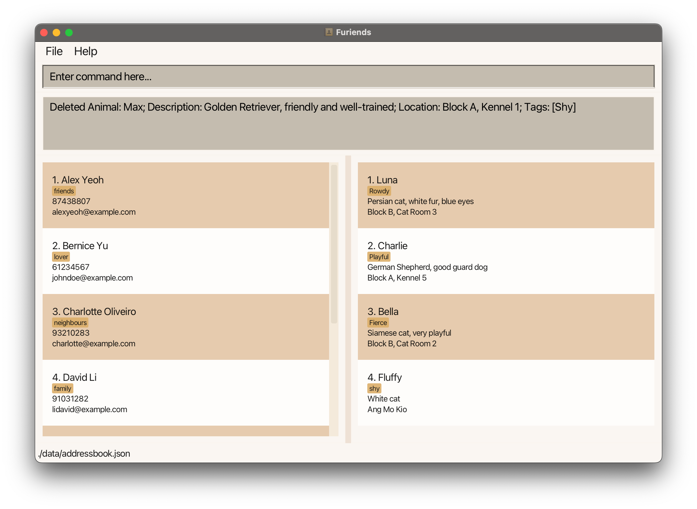{style="width:900px; height:auto;"}<br>

<box type="warning" seamless>

When `deleting` after a [`find`](#finding-people-by-name-find-person) command, only contacts that show up on the GUI (contacts that are found) can be deleted.

Be sure to use [`list`](#listing-all-contacts-list) to ensure all contacts can be deleted!

</box>

Back to [table of contents](#table-of-contents).

<div style="page-break-after: always;"></div>

### Deleting a feeding session : `delete feed`
Use the `delete feed` command to remove a specified feeding session from Furiends.

Format: `delete feed n/ANIMAL_NAME f/PERSON_NAME dt/DATETIME`

* Deletes the feeding session that corresponds to the same person, animal and feeding time.
* The names are **case-insensitive**.
* `DATETIME` must be a valid day and time.
* The order of `n/ANIMAL_NAME`, `f/PERSON_NAME` and `dt/DATETIME` does not matter.

Examples: refer to input restrictions [here](#valid-inputs-format)
* `delete feed n/Max f/Alex Yeoh dt/2025-01-24 09:00` <br>
  This command deletes the feeding session between `Max` and `Alex Yeoh` at `24 Jan 2025 09:00` from Furiends.
  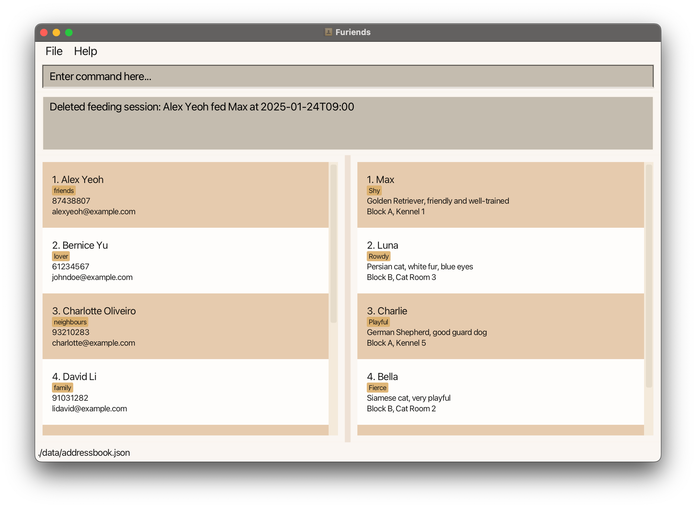{style="width:900px; height:auto;"}<br>

<div style="page-break-after: always;"></div>

<box type="warning" seamless>

**Cascade deletion between Person, Animal and Feeding Session:**

For a person and animal associated to the same feeding session:

**Scenario 1: Deleting a Person or Animal**
* Deleting either the person or animal will cause the associated feeding session to be deleted as well.
* The feeding session will no longer be displayed with the other animal or person respectively.

**Scenario 2: Deleting a Feeding Session**
* Deleting the feeding session will cause it to no longer be displayed with both the associated person and animal.

<box type="tip" seamless>

You may use `undo` to revert the deletion.
</box>

</box>

Back to [table of contents](#table-of-contents).

<div style="page-break-after: always;"></div>

### Viewing a person contact: `view person`

Use the `view person` command to display detailed information about a specific person from Furiends.

Format: `view person n/NAME`

* Views the person's contact information with the specified `NAME`.
* The name is **case-insensitive**, but it must be the full name.
* Shows the person's complete contact information in a detailed view.

Examples: refer to input restrictions [here](#valid-inputs-format)
* `view person n/Alex Yeoh` <br>
  This command displays detailed information for the person named `Alex Yeoh`.
* `view person n/alex yeoh` <br>
  This command also displays information for the person named `Alex Yeoh`.
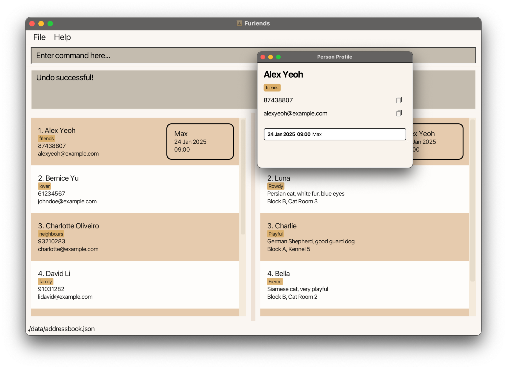{style="width:800px; height:auto;"}<br>

Back to [table of contents](#table-of-contents).

<div style="page-break-after: always;"></div>

### Viewing an animal contact: `view animal`

Use the `view animal` command to display detailed information about a specific animal from Furiends.

Format: `view animal n/NAME`

* Views the animal's contact information with the specified `NAME`.
* The name is **case-insensitive**, but it must be the full name.
* Shows the animal's complete information in a detailed view.

Examples: refer to input restrictions [here](#valid-inputs-format)
* `view animal n/Max` <br>
  This command displays detailed information for the animal named `Max`.
* `view animal n/max` <br>
  This command also displays information for the animal named `Max`.
  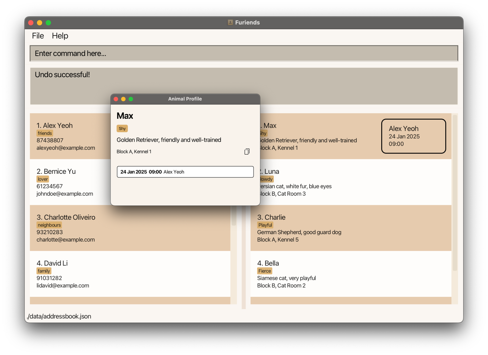{style="width:800px; height:auto;"}<br>

Back to [table of contents](#table-of-contents).

<div style="page-break-after: always;"></div>

### Undoing the last change: `undo`

Use the `undo` command to revert Furiends to its previous state before the last modifying command.

Format: `undo`

* You may only undo recent commands that change Furiends!

  - Commands that change Furiends: [`add person`](#adding-a-person-add-person), [`add animal`](#adding-an-animal-add-animal), [`edit person`](#editing-a-person-edit-person), [`edit animal`](#editing-an-animal-edit-animal), [`delete person`](#deleting-a-person-delete-person), [`delete animal`](#deleting-an-animal-delete-animal), [`clear`](#clearing-all-entries-clear), [`feed`](#feeding-an-animal-feed), or after a valid [`redo`](#redoing-an-undone-change-redo) command.
  - All other commands cannot be undone.
* If there are no changes to undo, an error message will be shown.
  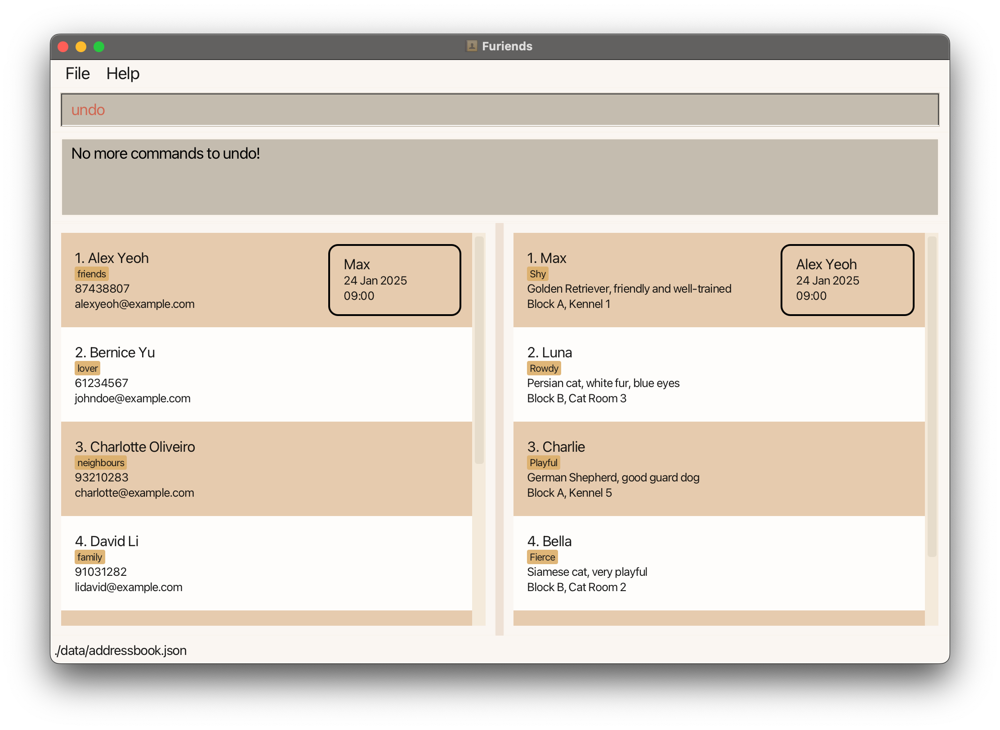{style="width:900px; height:auto;"}<br>

Example:
* After executing the `clear` command, all existing people's and animals' contacts are deleted.
  * Running `undo` will revert this command, by recovering to the state before `clear` was executed.

Back to [table of contents](#table-of-contents).

<div style="page-break-after: always;"></div>

### Redoing an undone change: `redo`

Use the `restore` command to restore Furiends to the state before the last `undo` command.

Format: `redo`

* If there are no changes to redo, an error message will be shown.
  {style="width:900px; height:auto;"}<br>

Example:
* `redo` Re-applies the last change that was undone.

<box type="warning" seamless>

Undo and Redo history **does not persist** across sessions
</box>
<br>

<div style="page-break-after: always;"></div>

### Clearing all entries: `clear`

Clears all entries from Furiends.

Format: `clear`

Back to [table of contents](#table-of-contents).

<br>

### Exiting the program : `exit`

Use the `exit` command to close the Furiends application.

Format: `exit`

<box type="tip" seamless>
You can also close the Furiends application by clicking on the cross at the top right hand corner of the main window.
</box>

Back to [table of contents](#table-of-contents).

<div style="page-break-after: always;"></div>

### Saving the data

Furiends automatically saves all your data in the hard disk after every command that changes the data. There is **no need to save manually**.

### Editing the data file

Furiends automatically saves its data as a JSON file `[JAR file location]/data/addressbook.json`. Advanced users are welcome to update data directly by editing that data file.

<box type="warning" seamless>

**Caution:**
If your changes to the data file makes its format **invalid**, Furiends will discard **all** data and start with an **empty** data file at the next run.  Hence, it is recommended to take a backup of the file before editing it.<br>
Furthermore, certain edits can cause Furiends to behave in unexpected ways (e.g., if a value entered is outside the acceptable range). Therefore, edit the data file only if you are confident that you can update it correctly.
</box>

<box type="tip" seamless>

If you have edited the data file, `addressbook.json`, **incorrectly**, please delete the data file in the `data` folder and relaunch the jar file. <br>
Do note that **all existing contacts** will be removed. The data file will be reverted to the original state.
</box>

Back to [table of contents](#table-of-contents).

------------------------------------------------------------------------------------------------

<div style="page-break-after: always;"></div>

## FAQ

**Q**: How do I transfer my data to another Computer?<br>
**A**: Install the app in the other computer and overwrite the empty data file it creates with the file that contains the data of your previous Furiends home folder.<br>

**Q**: How do I restore all the contacts after using `find` to filter?<br>
**A**: In the command input, enter `list` to view all contacts.<br>

**Q**: What should I do if an error message is shown in feedback box?<br>
**A**: You can try again by correcting to the correct input following the feedback box.
Or you can delete the wrong input and type `help` to get more help.<br>

**Q**: The app stopped working after I edited the data file, `addressbook.json`. What should I do? <br>
<box type="warning" seamless>
All existing contacts will be deleted after you perform this recovery step.
</box>

**A**: Delete the data file `addressbook.json` located in the `data` folder, where `furiends.jar` is located.
Relaunch the `jar` file. <br>

Back to [table of contents](#table-of-contents).

------------------------------------------------------------------------------------------------

<div style="page-break-after: always;"></div>

## Known issues

1. **When using multiple screens**, if you move the application to a secondary screen, and later switch to using only the primary screen, the GUI will open off-screen. The remedy is to delete the `preferences.json` file created by the application before running the application again.
2. **If you minimize the Help Window** and then run the `help` command (or use the `Help` menu, or the keyboard shortcut `F1`) again, the original Help Window will remain minimized, and no new Help Window will appear. The remedy is to manually restore the minimized Help Window.

Back to [table of contents](#table-of-contents).

------------------------------------------------------------------------------------------------

<div style="page-break-before: always;"></div>

## Command summary
* Refer to input restrictions [here](#valid-inputs-format).

Action (in alphabetical order) | Format, Examples
----------------------|------------------------------------------------------------------------------------------------
**Add Animal**                 | `add animal n/NAME d/DESCRIPTION l/LOCATION [t/TAG]…​` <br> e.g., `add animal n/Fluffy d/White cat l/Ang Mo Kio t/friendly`
**Add Person**                 | `add person n/NAME p/PHONE e/EMAIL [t/TAG]…​`<br>e.g.,`add person n/James Ho p/92224444 e/jamesho@example.com t/friend t/colleague`
**Clear**                      | `clear`
**Delete Animal**              | `delete animal n/NAME`<br> e.g., `delete animal n/Fluffy`
**Delete Feed**                | `delete feed n/ANIMAL_NAME f/PERSON_NAME dt/DATETIME`<br> e.g., `delete feed n/Fluffy f/John Doe dt/2005-04-09 10:00`
**Delete Person**              | `delete person n/NAME`<br> e.g., `delete person n/John Doe`
**Edit Animal**                | `edit animal NAME [n/NAME] [d/DESCRIPTION] [l/LOCATION] [t/TAG]…`<br> e.g., `edit animal Fluffy l/Void Deck`
**Edit Person**                | `edit person NAME [n/NAME] [p/PHONE] [e/EMAIL] [t/TAG]… ​`<br> e.g.,`edit person John Doe n/James Lee e/jameslee@example.com`
**Exit**                       | `exit`
**Feed**                       | `feed f/PERSON_NAME n/ANIMAL_NAME dt/DATETIME`<br> e.g., `feed n/Fluffy f/John Doe dt/2005-04-09 10:00`
**Find Animal**                | `find animal [n/KEYWORD] [t/KEYWORD] [MORE_KEYWORDS]`<br> e.g., `find n/Fluffy n/Max t/cute`
**Find Person**                | `find person [n/KEYWORD] [t/KEYWORD] [MORE_KEYWORDS]`<br> e.g., `find n/James t/family`
**Help**                       | `help [COMMAND]`<br> e.g. `help` <br> e.g. `help add person`
**List**                       | `list`
**Redo**                       | `redo`
**Undo**                       | `undo`
**View Person**                | `view person n/NAME`<br> e.g., `view person n/Alex Yeoh`
**View Animal**                | `view animal n/NAME`<br> e.g., `view animal n/Max`

Back to [table of contents](#table-of-contents).
